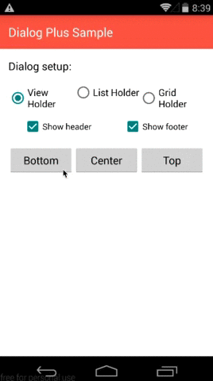

## 控件

|Name|Description|Demo|
|:---:|:---|:---:|
|[FlexibleRatingBar](https://github.com/Amagi82/FlexibleRatingBar)|系统的Ratingbar太难用了，该控件的可定制化更好||
|[AndroidTagGroup](https://github.com/2dxgujun/AndroidTagGroup)|标签云，支持编辑添加标签||
|[Android-PickerView](https://github.com/saiwu-bigkoo/Android-PickerView)|iOS 风格的时间、地址选择器||
|[SelectableRoundedImageView](https://github.com/pungrue26/SelectableRoundedImageView)|圆角可定制的 ImageView||
|[dialogplus](https://github.com/orhanobut/dialogplus)|各种各样的弹窗，可定制| |
|[Android AppMsg](https://github.com/johnkil/Android-AppMsg)|替代 Toast||
|[SlideDateTimePicker]()|时间日期选择器||
|[ViewPagerIndicator](https://github.com/JakeWharton/ViewPagerIndicator)|ViewPager翻页时的指示器||
|[CircleImageView](https://github.com/hdodenhof/CircleImageView)|圆形 ImageView，比如圆形头像就可以使用该控件||

## 网络库

|Name|Description|
|:---:|:---|
|[android-async-http](https://github.com/loopj/android-async-http)|很强大的异步网络库，网络访问在非 UI 线程中执行，在 UI 线程中回调。|

## JSON 解析

|Name|Description|
|:---:|:---|
|[FastJson](https://github.com/alibaba/fastjson)|天下武功，无坚不摧，唯快不破。FastJson 是迄今为止最快的 JSON 解析库。好吧，不知道要不要加之一|

## Adapter

|Name|Description|
|:---:|:---|
|[base-adapter-helper]()|BseAdapter的封装类，对其进行了高度封装。用户只需要关注逻辑即可，不需要写重复的代码|

## 图片加载

|Name|Description|
|:---:|:---|
|UIL||
|Glide||
|Picaso||

## ORM
