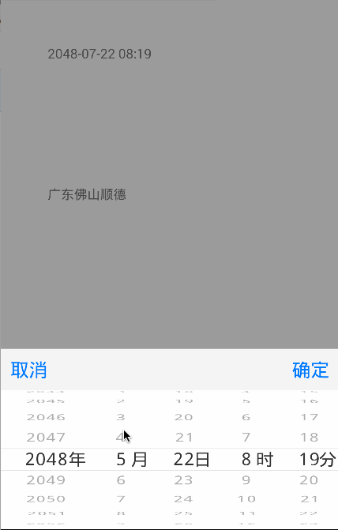
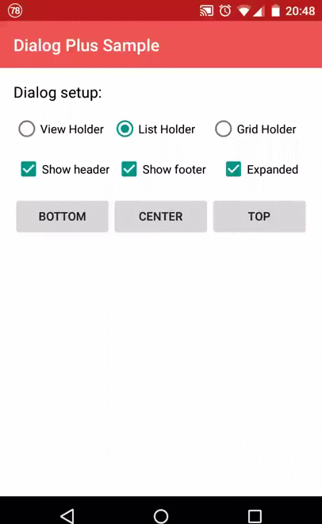

## 控件
---

### 星级评分

|Name|Description|Demo|
|:---:|:---|:---:|
|[FlexibleRatingBar](https://github.com/Amagi82/FlexibleRatingBar)|系统的Ratingbar太难用了，该控件的可定制化更好||

### 标签云

|Name|Description|Demo|
|:---:|:---|:---:|
|[AndroidTagGroup](https://github.com/2dxgujun/AndroidTagGroup)|标签云，支持编辑添加标签||

### 选择器

|Name|Description|Demo|
|:---:|:---|:---:|
|[Android-PickerView](https://github.com/saiwu-bigkoo/Android-PickerView)|iOS 风格的时间、地址选择器||
|[SlideDateTimePicker]()|时间日期选择器||

### 弹窗

|Name|Description|Demo|
|:---:|:---|:---:|
|[dialogplus](https://github.com/orhanobut/dialogplus)|各种各样的弹窗，可定制| |

### 消息提示
|Name|Description|Demo|
|:---:|:---|:---:|
|[Android AppMsg](https://github.com/johnkil/Android-AppMsg)|替代 Toast||
|[Crouton](https://github.com/keyboardsurfer/Crouton)|Context sensitive notifications for Android|

### 指示器

|Name|Description|Demo|
|:---:|:---|:---:|
|[ViewPagerIndicator](https://github.com/JakeWharton/ViewPagerIndicator)|ViewPager翻页时的指示器||
|[IndicatorVIew](https://github.com/xzwszl/IndicatorVIew)|A good indicator widget for show the current status or position of Items in ViewPager and other ViewContainers.||

### 圆角 ImageView

|Name|Description|Demo|
|:---:|:---|:---:|
|[CircleImageView](https://github.com/hdodenhof/CircleImageView)|圆形 ImageView，比如圆形头像就可以使用该控件||
|[SelectableRoundedImageView](https://github.com/pungrue26/SelectableRoundedImageView)|圆角可定制的 ImageView||

### 九宫格

|Name|Description|Demo|
|:---:|:---|:---:|
|[NineGridView](https://github.com/panyiho/NineGridView)|一个九宫格自定义控件，实现类似微信和微博的九宫格图片显示||
|[SquareGridView](https://github.com/aliouswang/SquareGridView)|Android九宫格控件-可在ListView和RecyclerView中使用。介绍文章：http://www.jianshu.com/p/66c443183ab9|无图|

### 状态提示

|Name|Description|Demo|
|:---:|:---|:---:|
|[MaterialPageStateLayout](https://github.com/Syehunter/MaterialPageStateLayout)|PageStateLayout could let you show [Loading][Empty][Error][Succeed][Requesting] state in Activity, Fragment, ViewGroup as you want.||
|[android-empty-layout](https://github.com/alamkanak/android-empty-layout)|A library for showing different types of layouts when a list view is empty||
|[AndroidProgressLayout](https://github.com/antonkrasov/AndroidProgressLayout)|Android View to simplify working with ProgressBar||
|[MultipleStatusView](https://github.com/qyxxjd/MultipleStatusView)|一个支持多种状态的自定义View,可以方便的切换到：加载中视图、错误视图、空数据视图、网络异常视图、内容视图。||

### 日历

|Name|Description|Demo|
|:---:|:---|:---:|
|[Android-Week-View](https://github.com/alamkanak/Android-Week-View)|Android Week View is an android library to display calendars (week view or day view) within the app. It supports custom styling.||

### 动画

|Name|Description|Demo|
|:---:|:---|:---:|
|[模仿喵街特效](https://github.com/dongjunkun/miaojiedemo)|通过RecyclerView实现喵街首页View滑动折叠效果||

### 引导页

|Name|Description|Demo|
|:---:|:---|:---:|
|[ShowcaseView](https://github.com/amlcurran/ShowcaseView)|Highlight the best bits of your app to users quickly, simply, and cool||

## 网络库
---
|Name|Description|
|:---:|:---|
|[Volley](https://android.googlesource.com/platform/frameworks/volley)|Google 自家的网络库，适合大并发、小流量的场景使用|
|[android-async-http](https://github.com/loopj/android-async-http)|很强大的异步网络库，网络访问在非 UI 线程中执行，在 UI 线程中回调。|
|[retrofit](https://github.com/square/retrofit)|如果服务端的 API 符合Restful 规范，用这个库写很爽|

## 完整项目
---
|Name|Description|Demo|
|:---:|:---|:---:|
|[EasyGank](https://github.com/CaMnter/EasyGank)|Gank.io的开源项目||
|[https://github.com/antoniolg/androidmvp](https://github.com/antoniolg/androidmvp)|MVP Android Example|暂无|
|[archi](https://github.com/ivacf/archi)|Standard、MVP、MVVM 三种方式实现 app||

## JSON 解析
---
|Name|Description|
|:---:|:---|
|[FastJson](https://github.com/alibaba/fastjson)|天下武功，无坚不摧，唯快不破。FastJson 是迄今为止最快的 JSON 解析库。好吧，不知道要不要加之一|

## Adapter
---
|Name|Description|
|:---:|:---|
|[base-adapter-helper](https://github.com/JoanZapata/base-adapter-helper)|BseAdapter的封装类，对其进行了高度封装。用户只需要关注逻辑即可，不需要写重复的代码|

## 图片加载
---
|Name|Description|
|:---:|:---|
|[Android-Universal-Image-Loader](https://github.com/nostra13/Android-Universal-Image-Loader)|著名的 UIL，定制化很高|
|[Picaso](https://github.com/square/picasso)|Square 公司开源的图片加载框架。其 API 为链式，使用方便|
|[Glide](https://github.com/bumptech/glide)|Google 推荐的图片加载框架，性能比 [Picaso](https://github.com/square/picasso) 好|

## ORM
---
|Name|Description|
|:---:|:---|
|[ActiveAndroid](https://github.com/pardom/ActiveAndroid)|我使用的第一款 ORM 框架，其 API 调用方式简单，可读性高|
|[realm-java](https://github.com/realm/realm-java)|NoSQL 数据库，性能比 SQLite 好|

## 注解
---
|Name|Description|
|:---:|:---|
|[butterknife](https://github.com/JakeWharton/butterknife)|是不是觉得写 `findViewById()` 很麻烦，它可以帮助你从重复的工作中解放出来|